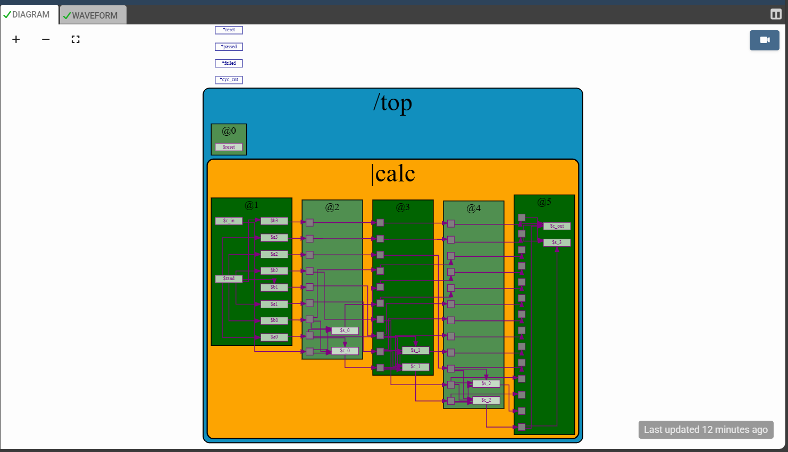
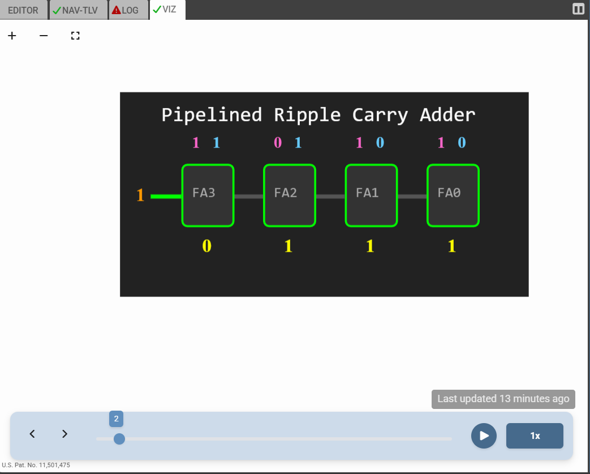

# Makerchip-VIZ-Prototypes

This repository contains functional prototypes and visual experiments developed as a proof-of-concept for my FOSSi Foundation Google Summer of Code 2026 proposal.

As an Electronics and Communication Engineering (ECE) student, my primary focus is leveraging Makerchip's VIZ feature to translate abstract hardware logic into intuitive, real-time visual interfaces.

In simple words, I have created two prototypes(one Ripple Carry Adder and second Opcode Decoder VIZ). I focused on VIZ especially. Annnd, here are the details-

## Ripple Carry Adder 
To bridge my academic coursework in Digital System Design with the Makerchip ecosystem, I implemented a foundational Ripple Carry Adder. The core digital logic was written in TL-Verilog, highlighting its streamlined and highly efficient syntax compared to traditional SystemVerilog.

This is the diagram of the Ripple carry Adder- 

The VIZ Engineering: The primary technical challenge—and triumph—of this prototype was engineering the VIZ bridge to correctly synchronize with the simulation cycles. I successfully debugged the pipeline to display the present sum outputs without cycle delays, ensuring an accurate, real-time visual representation of the carry propagation.

## Bit-Slicer (or "RISC-V Opcode Decoder")

Building upon the decoding logic concepts from mentor Steve Hoover's single-cycle CPU curriculum, this prototype tackles the cognitive overload of reading machine code.
The "Bit-Slicer" visually decomposes a standard 32-bit RISC-V instruction. Instead of forcing the user to decipher a dense string of binary, the custom VIZ logic actively parses the instruction and maps it into color-coded, labeled fields (R, I, S, B, U, J formats) at a single glance. This serves as the foundational UI prototype for my GSoC microelectronics pedagogy proposal.

# How to Run These Prototypes

To see the logic and visualizations in action:
1. Copy the contents of the respective .tlv files.
2. Paste the code into the Makerchip IDE.
3. Compile and open the VIZ pane to interact with the logic!
